# AI agents that never start from zero

> Generated by Cairn from the project knowledge graph.

## Goals
- **AI agents that never start from zero** _(accepted)_ — Capture a project's intent as a typed knowledge graph committed to .cairn/, so any fresh, context-free session resumes with full understanding instead of re-interrogating the user.

## Requirements
- **Persist intent as a typed knowledge graph** _(accepted)_ — Brainstorm output becomes typed nodes and edges in .cairn/graph.json, versioned in git right beside the code.
- **Resume full context in a fresh session** _(accepted)_ — A context-free agent reads a stable resume brief: goals, accepted decisions, components with their dependencies, open questions, and suggested next actions.
- **Guarantee test-first builds** _(accepted)_ — Every unit starts from a provably real red — a behavioral assertion that exercised the unit — never a missing-symbol error mistaken for a failing test.
- **Install missing capabilities on demand** _(accepted)_ — When a request needs a capability Cairn doesn't ship, discover and install the right skill from the open agent-skills ecosystem after checking the built-ins first.

## Decisions
- **pnpm monorepo, TypeScript strict ESM, Vitest + Biome** _(accepted)_ — One workspace, three packages, strict types, ESM only, no legacy or back-compat shims.
- **Keep the core engine pure and deterministic** _(accepted)_ — The clock and session id are injected, so identical operations always produce an identical committed graph across machines.
- **Classify a real red vs a missing-symbol** _(accepted)_ — Precedence is collection -> missing-symbol -> assertion -> pass -> unknown; only a clean assertion counts as a legitimate red to build against.
- **Studio is a zero-dependency Node server + self-contained HTML wizard** _(accepted)_ — A CSRF-guarded live browser session for brainstorming, with a static wizard fallback for headless environments.
- **Ship skills on the Vercel `npx skills` open standard** _(accepted)_ — Install with `npx skills add AnkushBL6/cairn@<skill>`; works across Claude Code, Cursor, Copilot and 18+ agents.
- **Enforce a typed edge-legality table** _(accepted)_ — An edge is only allowed when its (type, from-type, to-type) triple is semantically valid, so the graph can never encode a nonsensical relationship.

## Components
- **@cairn/core** _(done)_ — The pure graph engine: typed nodes/edges, integrity invariants, the Mermaid + design-doc renderers, the resume brief, and the test-failure classifier. Built 100% test-first.
- **@cairn/studio** _(done)_ — Zero-dependency Node server plus a world-class self-contained HTML brainstorming wizard, with a static fallback.
- **@cairn/cli** _(done)_ — The `cairn` command that wires the engine and studio to disk: init, studio, ingest, graph, resume, classify.
- **Cairn skillpack (six skills)** _(done)_ — brainstorm, resume, tdd, frontend, backend, router — each reads the project graph instead of re-interrogating the user.
- **Marketing website + docs** _(done)_ — Production-grade Next.js site (standalone, Lighthouse 99/100/100/100) with docs pages and an interactive graph playground.
- **Cairn TDD Guard GitHub Action** _(done)_ — A reusable composite GitHub Action wrapping the classifier so any repo enforces guaranteed-TDD on PRs. Ships a zero-dependency vendored classifier kept in lockstep with @cairn/core by a parity test.

## Constraints
- **Node >= 22, ESM only, no legacy code** _(accepted)_ — Only clean, current code ships — no back-compat shims, no dead paths (noUnusedLocals/Parameters on).
- **No filesystem or ambient I/O in @cairn/core** _(accepted)_ — All disk I/O lives in the CLI store, so the engine stays pure, deterministic, and trivially testable.
- **Vercel CLI must be >= 54** _(accepted)_ — The old 39.x used a discontinued login flow that just opened a changelog page; deploy with a modern CLI.

## Open Questions
- **Publish @cairn/* to npm?** — Today install is only `npx skills add`; npm publishing would enable `npm i @cairn/core` plus a tagged release pipeline (Changesets).
- **Host the studio brainstorming wizard online?** — A hosted playground would let people try the typed-graph model without installing anything locally.

## Risks
- **Classifier drift between core and the Action** — The zero-install Action vendors the classifier; without a parity test it can silently diverge from @cairn/core.
- **Graph schema migrations** — GraphDoc is version 1; evolving the node/edge vocabulary will need a migration path so old committed brains still load.

## Graph

```mermaid
flowchart TD
  n_goal__ai_agents_that_never_start_from_zero["goal: AI agents that never start from zero"]
  n_requirement__persist_intent_as_a_typed_knowledge_graph["requirement: Persist intent as a typed knowledge graph"]
  n_requirement__resume_full_context_in_a_fresh_session["requirement: Resume full context in a fresh session"]
  n_requirement__guarantee_test_first_builds["requirement: Guarantee test-first builds"]
  n_requirement__install_missing_capabilities_on_demand["requirement: Install missing capabilities on demand"]
  n_decision__pnpm_monorepo_typescript_strict_esm_vitest_biome["decision: pnpm monorepo, TypeScript strict ESM, Vitest + Biome"]
  n_decision__keep_the_core_engine_pure_and_deterministic["decision: Keep the core engine pure and deterministic"]
  n_decision__classify_a_real_red_vs_a_missing_symbol["decision: Classify a real red vs a missing-symbol"]
  n_decision__studio_is_a_zero_dependency_node_server_self_contained_html["decision: Studio is a zero-dependency Node server + self-contained HTML wizard"]
  n_decision__ship_skills_on_the_vercel_npx_skills_open_standard["decision: Ship skills on the Vercel `npx skills` open standard"]
  n_decision__enforce_a_typed_edge_legality_table["decision: Enforce a typed edge-legality table"]
  n_component__cairn_core["component: @cairn/core"]
  n_component__cairn_studio["component: @cairn/studio"]
  n_component__cairn_cli["component: @cairn/cli"]
  n_component__cairn_skillpack_six_skills["component: Cairn skillpack (six skills)"]
  n_component__marketing_website_docs["component: Marketing website + docs"]
  n_component__cairn_tdd_guard_github_action["component: Cairn TDD Guard GitHub Action"]
  n_constraint__node_22_esm_only_no_legacy_code["constraint: Node >= 22, ESM only, no legacy code"]
  n_constraint__no_filesystem_or_ambient_i_o_in_cairn_core["constraint: No filesystem or ambient I/O in @cairn/core"]
  n_constraint__vercel_cli_must_be_54["constraint: Vercel CLI must be >= 54"]
  n_question__publish_cairn_to_npm["question: Publish @cairn/* to npm?"]
  n_question__host_the_studio_brainstorming_wizard_online["question: Host the studio brainstorming wizard online?"]
  n_risk__classifier_drift_between_core_and_the_action["risk: Classifier drift between core and the Action"]
  n_risk__graph_schema_migrations["risk: Graph schema migrations"]
  n_test__classify_failure_unit_suite["test: classify-failure unit suite"]
  n_test__action_core_classifier_parity_test["test: Action <-> core classifier parity test"]
  n_artifact__the_cairn_project_brain_graph_json["artifact: The .cairn/ project brain (graph.json)"]
  n_artifact__generated_design_md_graph_mmd["artifact: Generated design.md + graph.mmd"]
  n_requirement__persist_intent_as_a_typed_knowledge_graph -->|refines| n_goal__ai_agents_that_never_start_from_zero
  n_requirement__resume_full_context_in_a_fresh_session -->|refines| n_goal__ai_agents_that_never_start_from_zero
  n_requirement__guarantee_test_first_builds -->|refines| n_goal__ai_agents_that_never_start_from_zero
  n_requirement__install_missing_capabilities_on_demand -->|refines| n_goal__ai_agents_that_never_start_from_zero
  n_requirement__persist_intent_as_a_typed_knowledge_graph -->|decided_by| n_decision__enforce_a_typed_edge_legality_table
  n_requirement__persist_intent_as_a_typed_knowledge_graph -->|decided_by| n_decision__keep_the_core_engine_pure_and_deterministic
  n_requirement__guarantee_test_first_builds -->|decided_by| n_decision__classify_a_real_red_vs_a_missing_symbol
  n_component__cairn_core -->|decided_by| n_decision__pnpm_monorepo_typescript_strict_esm_vitest_biome
  n_component__cairn_studio -->|decided_by| n_decision__studio_is_a_zero_dependency_node_server_self_contained_html
  n_requirement__install_missing_capabilities_on_demand -->|decided_by| n_decision__ship_skills_on_the_vercel_npx_skills_open_standard
  n_component__cairn_skillpack_six_skills -->|decided_by| n_decision__ship_skills_on_the_vercel_npx_skills_open_standard
  n_component__cairn_cli -->|depends_on| n_component__cairn_core
  n_component__cairn_cli -->|depends_on| n_component__cairn_studio
  n_component__cairn_skillpack_six_skills -->|depends_on| n_component__cairn_cli
  n_component__cairn_tdd_guard_github_action -->|depends_on| n_component__cairn_core
  n_component__cairn_core -->|implements| n_requirement__persist_intent_as_a_typed_knowledge_graph
  n_component__cairn_core -->|implements| n_requirement__guarantee_test_first_builds
  n_component__cairn_studio -->|implements| n_requirement__persist_intent_as_a_typed_knowledge_graph
  n_component__cairn_cli -->|implements| n_requirement__resume_full_context_in_a_fresh_session
  n_component__cairn_skillpack_six_skills -->|implements| n_requirement__install_missing_capabilities_on_demand
  n_component__cairn_tdd_guard_github_action -->|implements| n_requirement__guarantee_test_first_builds
  n_artifact__the_cairn_project_brain_graph_json -->|implements| n_requirement__persist_intent_as_a_typed_knowledge_graph
  n_artifact__generated_design_md_graph_mmd -->|implements| n_requirement__resume_full_context_in_a_fresh_session
  n_test__classify_failure_unit_suite -->|tests| n_component__cairn_core
  n_test__action_core_classifier_parity_test -->|tests| n_component__cairn_tdd_guard_github_action
  n_risk__classifier_drift_between_core_and_the_action -->|blocks| n_component__cairn_tdd_guard_github_action
  n_risk__graph_schema_migrations -->|blocks| n_component__cairn_core
  n_question__publish_cairn_to_npm -->|blocks| n_component__cairn_cli
  n_question__host_the_studio_brainstorming_wizard_online -->|blocks| n_component__marketing_website_docs
  n_constraint__vercel_cli_must_be_54 -->|blocks| n_component__marketing_website_docs
  n_artifact__generated_design_md_graph_mmd -->|derived_from| n_artifact__the_cairn_project_brain_graph_json
```

