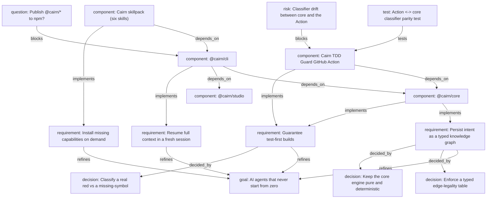

<div align="center">

# 🪨 Cairn

### Your AI never starts from zero.

Cairn is an opinionated **skillpack** that gives an AI agent **continuity**: a brainstorm becomes a knowledge graph your project carries forever, every new session resumes with full context, code is built **test-first with real guarantees**, and any missing capability is **installed on demand**.

</div>

---

## The idea

A chat ends and its context evaporates. The next session re-asks everything you already decided. Cairn fixes that by capturing intent as a **typed knowledge graph** committed to your repo (`.cairn/`). Every Cairn skill reads that graph instead of re-interrogating you.

```
idea ─▶ interactive studio ─▶ knowledge graph (.cairn/) ─▶ test-first build ─▶ resume anywhere
```

## What's in the box

### Packages (`packages/`)

| Package | What it is |
|---|---|
| **`@cairn/core`** | The pure, deterministic knowledge-graph engine: typed nodes/edges, integrity invariants, renderers (Mermaid + design doc), the resume brief, and the test-failure classifier behind guaranteed TDD. Built 100% test-first. |
| **`@cairn/studio`** | A tiny zero-dependency Node server + a world-class self-contained HTML wizard for browser-based brainstorming (with a static fallback for headless environments). |
| **`@cairn/cli`** | The `cairn` command: runs studio sessions, synthesizes the graph, and resumes. |

### Skills (`skills/`) — Vercel skills standard

| Skill | Use it to… |
|---|---|
| **cairn-brainstorm** | Turn an idea into a persisted knowledge graph via an intuitive browser interview. |
| **cairn-resume** | Reload the whole project into a fresh, context-free session. |
| **cairn-tdd** | Build test-first with tool-enforced guarantees (a real red, not "function not found"). |
| **cairn-frontend** | Build world-class, accessible UI driven by the graph. |
| **cairn-backend** | Build typed, observable services with logic built test-first. |
| **cairn-router** | Discover & install any other skill on demand (`npx skills`). |

> The build skills stand on the best in the ecosystem: **cairn-frontend** folds in Vercel's React best-practices (kill waterfalls, server-first, bundle discipline), **cairn-backend** folds in Vercel Functions runtime constraints, and all of them adopt **Andrej Karpathy's** coding principles — think before coding, simplicity first, surgical changes, goal-driven verification.

### Website (`website/`)

A production-grade Next.js marketing site. Deploy to Vercel with **Root Directory = `website`**.

## The guaranteed-TDD fix

Ordinary "TDD" often starts from a *missing-symbol* error (`retryOperation is not a function`), mistakes it for a real red, and builds on it — so you get "function not found" with no proof the logic was ever tested. Cairn's classifier draws the line:

```bash
$ npm test | cairn classify --assert-red
# missing-symbol  -> exit 2  (NOT a real red — scaffold the signature first)
# assertion       -> exit 0  (real red — now write the code)
```

Four guarantees: **G1** red for the right reason · **G2** proof of execution · **G3** watched transitions · **G4** no orphan code.

### Enforce it in CI — the TDD Guard Action

The same classifier ships as a reusable, **zero-install** GitHub Action ([`actions/cairn-classify`](actions/cairn-classify)). Drop it into any repo to fail a PR unless a new test fails for the *right* reason:

```yaml
- uses: AnkushBL6/cairn/actions/cairn-classify@main
  with:
    command: npm test     # or: file: path/to/captured-output.txt
    assert-red: 'true'    # exit 2 unless the failure is a real assertion red
```

It runs on pure Node (no dependencies), and a parity test keeps its vendored classifier byte-for-byte in lockstep with `@cairn/core` so the two can never drift.

## Quick start

```bash
# Install the skills into your agent (Claude Code, Cursor, Copilot, …)
npx skills add AnkushBL6/cairn

# Or use the CLI directly in a repo
cairn init
cairn studio --interview interview.json   # brainstorm in the browser
cairn graph apply ops.json                # capture it as a graph
cairn resume                              # a fresh session reads this first
```

## Develop

```bash
pnpm install
pnpm test        # 134 tests across the engine, studio, and CLI
pnpm build       # build all packages (topological)
pnpm lint        # Biome
```

Requirements: Node ≥ 22, pnpm. The website installs separately (`npm --prefix website install`).

## Architecture

`@cairn/core` is pure (no I/O, injected clock/ids) which is why it's exhaustively testable — and why Cairn dogfoods its own TDD workflow to build it. The CLI is the only layer that touches disk; the studio is the only layer that opens a socket. Strict, one-directional dependencies:

```
skills ─▶ @cairn/cli ─▶ @cairn/studio
                   └──▶ @cairn/core (pure)
```

## Cairn, mapped by Cairn

Cairn eats its own dog food. This repository carries its **own** project brain in [`.cairn/`](.cairn/) — the same typed knowledge graph every Cairn skill produces. A fresh, context-free session can run `cairn resume` here and immediately know the goals, the accepted decisions, what's built, what's open, and what to do next:

```
## Components
  • [done] @cairn/core
  • [done] @cairn/studio
  • [done] @cairn/cli (depends on: @cairn/core, @cairn/studio)
  • [done] Cairn skillpack (six skills) (depends on: @cairn/cli)
  • [done] Marketing website + docs
  • [done] Cairn TDD Guard GitHub Action (depends on: @cairn/core)

## Suggested next actions
  • Answer open question: Publish @cairn/* to npm?
  • Mitigate risk: Classifier drift between core and the Action
  • Mitigate risk: Graph schema migrations
```

The full narrative lives in [`.cairn/design.md`](.cairn/design.md) (regenerated from the graph on every save). Here is the live graph, rendered straight from [`.cairn/graph.mmd`](.cairn/graph.mmd):

<details>
<summary><strong>The Cairn knowledge graph</strong> (28 nodes · 31 edges)</summary>



</details>

## License

MIT © 2026 Cairn
