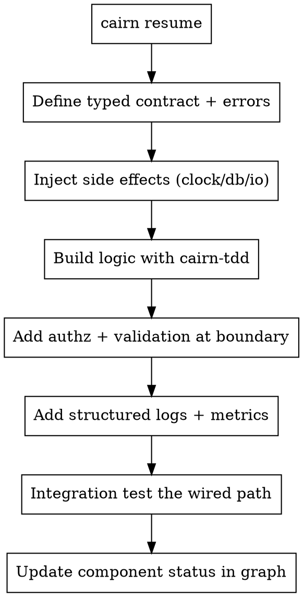

# Cairn — Backend

## Overview

Build services that are correct, secure, and operable. The graph holds the goals, the data decisions, and the constraints — read it first, then design boundaries that someone else (including a future you with no context) can understand.

**Core principle:** Design the contracts and the failure modes first. The happy path is the easy 20%.

## Before you build

```bash
cairn resume     # what service? what data decisions? what constraints (latency, compliance)?
```

Pull the relevant `component`, `requirement`, `constraint`, and `decision` nodes. Missing or fuzzy contract? Back to `cairn-brainstorm`.

## The standard (non-negotiable)

1. **Explicit contracts.** Every endpoint/function has a typed input and output and a documented set of errors. Validate input at the boundary; never trust it.
2. **Clear boundaries.** One module, one responsibility, one reason to change. Side effects (I/O, clock, randomness) are injected so the logic is pure and testable — the way `@cairn/core` itself is built.
3. **Failure modes are designed.** Decide, per operation: what's retryable, what's idempotent, what's a hard fail. Return typed errors, not stringly-typed surprises. Never swallow an error silently.
4. **Security by default.** Parameterized queries, authz checks at the boundary, secrets from the environment (never committed), least privilege, no PII in logs.
5. **Observability.** Structured logs with correlation, metrics on the paths that matter, and errors that carry enough context to debug from a dashboard.
6. **Data changes are reversible.** Migrations are forward-only and reviewed; never mutate the shape of persisted data without a migration.

## Serverless & runtime discipline (from Vercel Functions)

When the service ships to a serverless/edge platform (Vercel, Lambda, Workers), the runtime *shapes the design* — get these wrong and it fails only in production:

- **Web-standard handlers.** Named exports (`export async function GET/POST`) using the Web `Request`/`Response` API — not Express, not `NextApiRequest`.
- **Pick the runtime deliberately.** Node.js for full APIs, DB drivers, heavy deps. Edge for auth/redirect/transform at sub-millisecond cold start — but it has no `fs` and no native modules.
- **The filesystem is ephemeral and read-only.** Persist to object storage or a database (Blob, Neon, Upstash), never local files.
- **Process memory isn't shared across invocations.** An in-process `Map`/LRU cache won't survive — use a real cache (Runtime Cache, Redis).
- **Respect execution limits.** Return fast; push post-response work to `waitUntil`/`after`. For long-running, polling, or retrying flows, use a durable workflow engine — not `setTimeout` loops in a handler.
- **Pool DB connections** (serverless drivers) so cold starts don't exhaust them.
- **Cron endpoints are public HTTP** — protect them with a shared secret.

## Logic is test-first — always

Every non-trivial unit (validation, business rules, data mapping, retries) is built with **`cairn-tdd`**. Inject the clock/uuid/db so the unit is deterministic and the test exercises real behavior. This is where `cairn-tdd`'s G1/G2 guarantees pay off most: backends are full of functions that "exist" but were never actually tested.

## Flow



## When you finish

Update status in place with `graph set` (not `graph add`, which would duplicate):

```bash
cairn graph set --type component --title "PaymentsService" --status done
```

Record any new `decision` (e.g., "chose Stripe") and resolve the `question` it answered, so the graph stays the source of truth.

## Red Flags

| Thought | Reality |
|---|---|
| "I'll validate later." | Validate at the boundary, now. Untrusted input is the threat. |
| "Just catch and ignore." | Silent failures are the worst failures. Type your errors. |
| "I'll inline the DB call in the logic." | Inject it. Otherwise the logic can't be tested. |
| "Logging is noise." | Structured logs are how you debug production. |
| "This function obviously works." | If it's not tested, it doesn't ship (G4). |
| "I'll write to a temp file." | Serverless filesystems are ephemeral/read-only. Use storage or a DB. |
| "I'll add a config flag, just in case." | No speculative flexibility. Build what's asked; every line traces to a requirement. |
