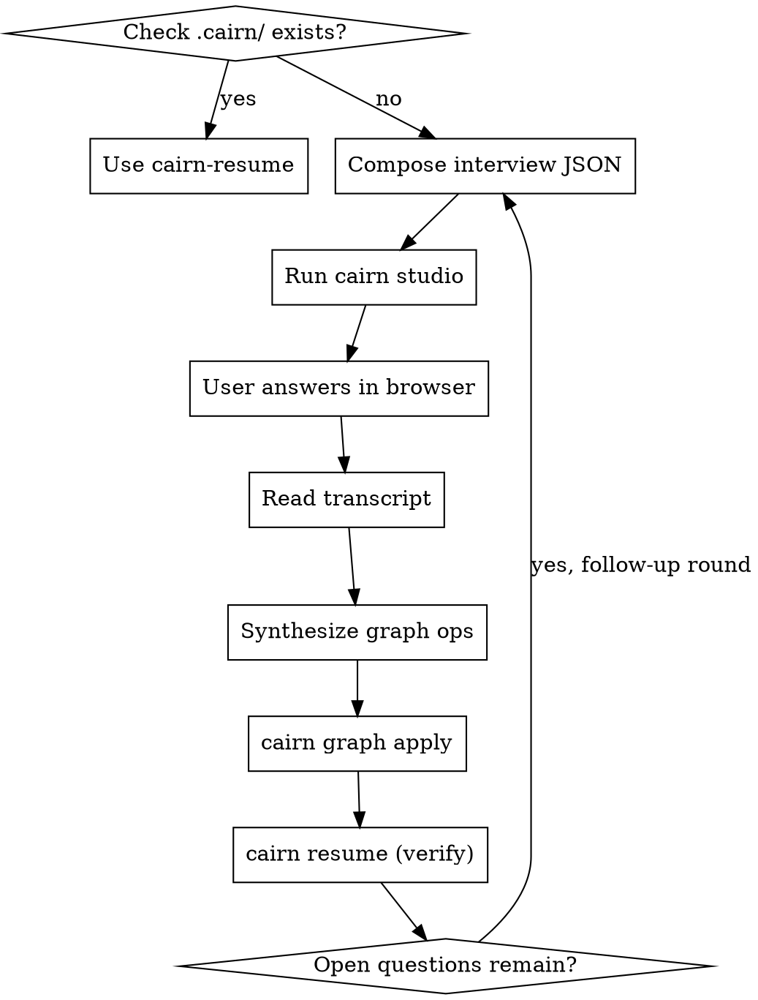

# Cairn — Brainstorm to Graph

## Overview

Turn a raw idea into a structured, **persisted** design through an intuitive browser interview — then write it into the project's knowledge graph. The graph is the project's brain: every later session, and every other Cairn skill, reads it instead of re-interrogating the user.

**Core principle:** A conversation is lost the moment the chat ends. A graph is forever. Capture intent as a graph, not as scrollback.

## When to Use

- Starting a new project or a substantial feature.
- Any time you're about to make design decisions you'll need to remember later.
- Whenever you catch yourself asking the user to "remind me what we decided."

**First, always check for an existing brain.** If `.cairn/graph.json` exists, STOP and use `cairn-resume` first — you may already have the context.

## The Flow



## Step 1 — Compose the interview

Write a JSON interview to `.cairn/.runtime/interview.json`. Ask about **purpose, constraints, success criteria, and the key forks** — one concept per question. Prefer `single`/`multi`/`scale` over free text where the space of answers is known; it's faster for the user and cleaner to graph.

```json
{
  "sessionId": "2026-06-13-checkout",
  "title": "Brainstorm: Checkout redesign",
  "intro": "A few questions to capture the shape of this work.",
  "questions": [
    { "id": "why", "kind": "longtext", "prompt": "What problem does this solve, and for whom?", "required": true },
    { "id": "stack", "kind": "single", "prompt": "Frontend stack?",
      "choices": [
        { "value": "next", "label": "Next.js", "description": "App Router, RSC" },
        { "value": "remix", "label": "Remix" }
      ] },
    { "id": "musts", "kind": "multi", "prompt": "Hard constraints?",
      "choices": [
        { "value": "a11y", "label": "WCAG AA accessibility" },
        { "value": "i18n", "label": "Internationalized" },
        { "value": "offline", "label": "Works offline" }
      ] },
    { "id": "risk", "kind": "scale", "prompt": "How risky is the payments integration? (1 low – 5 high)", "min": 1, "max": 5 }
  ]
}
```

Question kinds: `text`, `longtext`, `single`, `multi`, `scale` (needs `min`/`max`), `boolean`.

## Step 2 — Run the studio

```bash
cairn studio --interview .cairn/.runtime/interview.json
```

This opens a world-class wizard in the browser. The user answers; on finish, the transcript is saved and the command prints `{"transcriptPath": "...", "sessionId": "..."}`.

**Headless / no browser?** Use the static fallback:

```bash
cairn studio --interview .cairn/.runtime/interview.json --static
```

It writes a self-contained HTML file. The user opens it, answers, clicks **Export**, and pastes the JSON back to you. Save that with `cairn ingest <file>`.

## Step 3 — Synthesize the graph

Read the transcript, then map the answers to typed nodes and edges. This is where your judgment matters — you are distilling answers into durable structure.

| Answer is about… | Node type |
|---|---|
| Why we're building it | `goal` |
| What it must do | `requirement` |
| A choice made (+ rationale in `body`) | `decision` |
| A limit (tech/policy/time) | `constraint` |
| A thing to build | `component` |
| Something still undecided | `question` |
| A known danger | `risk` |

Write the ops to a file and apply atomically. Use `ref` aliases to connect nodes created in the same batch:

```json
{
  "nodes": [
    { "ref": "g",  "type": "goal", "title": "Reduce checkout abandonment" },
    { "ref": "r1", "type": "requirement", "title": "One-page checkout" },
    { "ref": "d1", "type": "decision", "title": "Use Next.js App Router", "body": "RSC streaming; team familiarity.", "status": "accepted" },
    { "ref": "c1", "type": "component", "title": "PaymentForm" },
    { "ref": "q1", "type": "question", "title": "Which PSP — Stripe or Adyen?" }
  ],
  "edges": [
    { "type": "refines", "from": "r1", "to": "g" },
    { "type": "decided_by", "from": "r1", "to": "d1" },
    { "type": "implements", "from": "c1", "to": "r1" },
    { "type": "blocks", "from": "q1", "to": "c1" }
  ]
}
```

```bash
cairn graph apply .cairn/.runtime/ops.json
```

## Step 4 — Verify & iterate

```bash
cairn resume
```

Read it back. If it doesn't capture the discussion faithfully, fix the ops and re-apply. For unresolved `question` nodes, run another short interview round focused on those — the studio supports adaptive follow-ups.

## Red Flags

| Thought | Reality |
|---|---|
| "I'll just remember this." | You won't, and the next session definitely won't. Graph it. |
| "Let me skip the interview and assume." | Assumptions are the bugs. Ask. |
| "I'll write the graph later." | Later never comes. Apply ops before you start building. |
| "Free-text everything." | Use single/multi/scale — faster for the user, cleaner graph. |

## Hand-off

Once the graph captures the design: components with open work hand off to `cairn-tdd` (logic), `cairn-frontend` (UI), and `cairn-backend` (services). Missing capabilities hand off to `cairn-router`.
