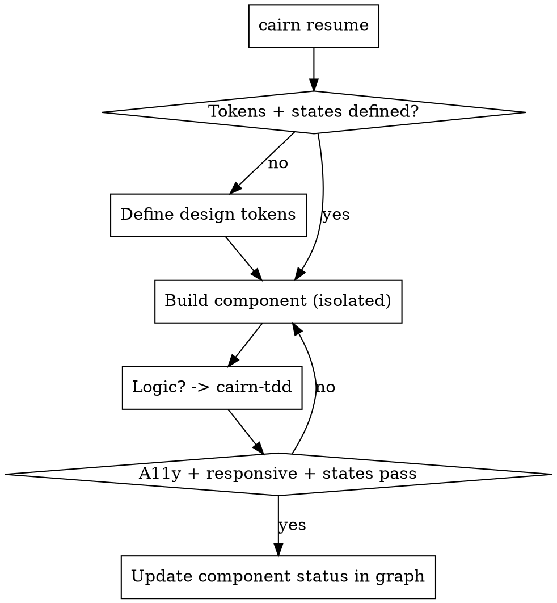

# Cairn — Frontend

## Overview

Build interfaces that are beautiful, accessible, fast, and **consistent with the project's decisions**. The graph already records the stack, constraints, and components — read it, don't re-ask.

**Core principle:** A UI is a system of tokens and states, not a pile of one-off styles. Design the system; the screens fall out of it.

## Before you touch a component

```bash
cairn resume        # stack? constraints (a11y, i18n, perf budgets)? which component?
```

Pull the relevant `component`, `requirement`, `constraint`, and `decision` nodes. If the design is missing or vague, go back to `cairn-brainstorm` rather than guessing.

## The standard (non-negotiable)

1. **Design tokens first.** Color, spacing, radius, type scale, shadow, motion — as variables. No magic numbers in components. Dark mode is a token swap, not a rewrite.
2. **Accessibility is a requirement, not a polish pass.** Semantic HTML, labelled controls, visible focus, keyboard paths, `prefers-reduced-motion`, AA contrast. If a `constraint` node says WCAG AA, it's a gate.
3. **Component isolation.** Each component has one job, a typed prop contract, and is understandable without reading its parents. State stays as local as it can.
4. **States are designed, not discovered.** Every component handles: default, loading, empty, error, and (where relevant) disabled and overflow/long-content.
5. **Performance is a feature.** Mind Core Web Vitals: no layout shift, lazy-load below the fold, ship less JS, prefer the platform. Animate `transform`/`opacity`, not layout.
6. **Responsive by construction.** Fluid layouts; test the smallest and largest target widths the `constraint` nodes imply.

## Logic vs. presentation

- **Presentational** markup/styles: build directly against the design tokens and states above.
- **Logic** (formatting, validation, reducers, data shaping): build it **test-first with `cairn-tdd`**. UI logic is exactly where silent bugs hide.

## Flow



## When you finish

Mark the component done so the next session and the rest of the team see it
(`graph set` updates in place — `graph add` would create a duplicate):

```bash
cairn graph set --type component --title "PaymentForm" --status done
```

## Red Flags

| Thought | Reality |
|---|---|
| "I'll hardcode this color/spacing." | Token it. One-offs are how design systems rot. |
| "Accessibility later." | It's a gate, not a chore. Build it in. |
| "Only the happy path matters." | Loading/empty/error are the product. |
| "What stack are we using again?" | `cairn resume`. The decision is recorded. |
| "Animate width/height for the slick effect." | That's jank. Animate transform/opacity. |
