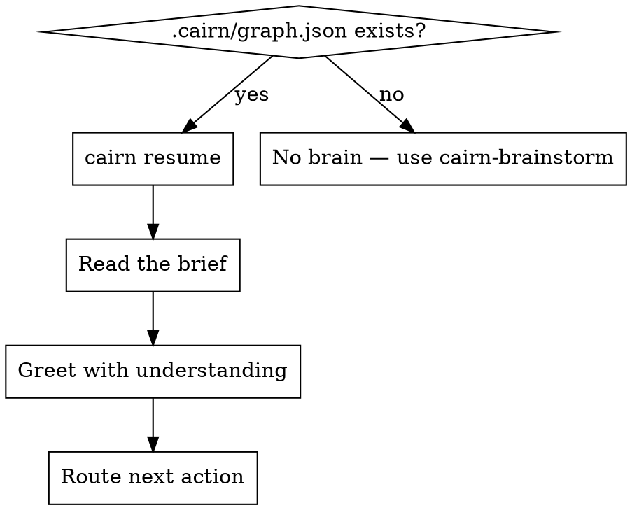

# Cairn — Resume Context

## Overview

A fresh chat has no memory. But the project does — it lives in `.cairn/`. This skill reloads that brain so you start *knowing* the project instead of asking the user to re-explain it.

**Core principle:** Never ask the user something the graph already answers.

## When to Use

- **The first thing you do** in any session inside a repo that contains `.cairn/graph.json`.
- After a context reset or hand-off.
- Any time you feel unsure "what was decided here."

## The Flow



## Step 1 — Load the brief

```bash
cairn resume
```

You get a structured summary:

- **Goals** — why this project exists.
- **Accepted decisions** — what was chosen, with rationale.
- **Components** — what's being built and each one's status (`open` / `accepted` / `done`).
- **Open questions** — what's still undecided.
- **Risks** — known dangers.
- **Suggested next actions** — the obvious next steps.

For the full picture, also run `cairn graph show` to see the Mermaid graph and counts.

## Step 2 — Greet with understanding

Tell the user what you now know — concisely — so they trust you have the context. For example:

> "Caught up. We're reducing checkout abandonment with a one-page Next.js checkout. `PaymentForm` is still open, and there's one unresolved question: Stripe vs Adyen. Want to settle that, or start on `PaymentForm`?"

Do **not** ask them to re-summarize the project. You just read it.

## Step 3 — Route

| What the brief shows | Where to go |
|---|---|
| Open `question` nodes | `cairn-brainstorm` (a focused follow-up round) |
| `component` with logic to build | `cairn-tdd` |
| `component` that is UI | `cairn-frontend` |
| `component` that is a service/API | `cairn-backend` |
| A needed capability with no matching skill | `cairn-router` |

## After building

When you finish a component, update its status so the next session knows:

```bash
cairn graph add --type component --title "PaymentForm" --status done
```

(Or apply an ops file. Keeping status current is what makes resume trustworthy.)

## Red Flags

| Thought | Reality |
|---|---|
| "Let me ask what this project is about." | Run `cairn resume` first. The graph knows. |
| "I'll skip resume, it's probably fine." | You'll re-litigate settled decisions. Always resume. |
| "The graph is stale." | Then update it — don't ignore it. Stale-but-updated beats forgotten. |
