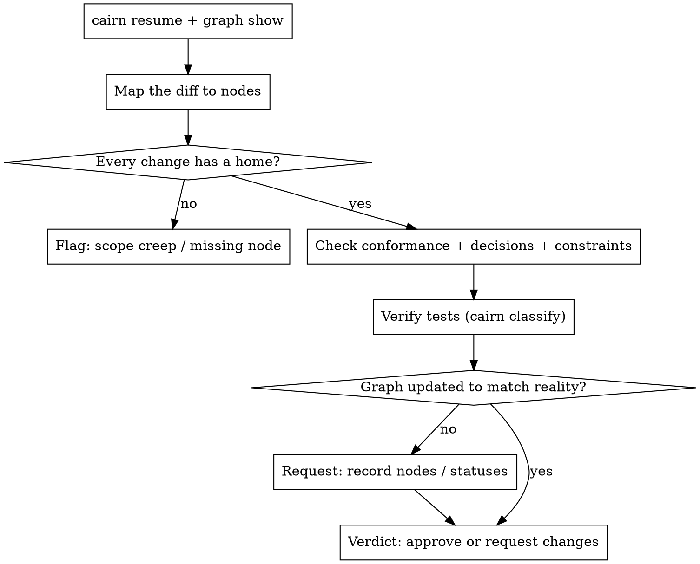

# Cairn — Review

## Overview

Most reviews check whether the code *looks* right. Cairn checks whether it does what the project actually decided to build. The graph in `.cairn/` already holds the requirements, the accepted decisions, and the hard constraints — so a review can be measured against the **spec**, not against taste.

**Core principle:** Review against the spec, not just the style. The graph is the spec.

## When to Use

- Before merging any change, diff, or PR of consequence.
- When you pick up someone else's branch and need to judge whether it's done.
- After `cairn-tdd` / `cairn-frontend` / `cairn-backend` finish a component, as the gate before it ships.

## Before you review

```bash
cairn resume        # the goals, decisions, constraints, and components this change touches
cairn graph show    # ids + statuses, so you can name exactly what the change claims to satisfy
```

Map the diff to the graph: which `requirement`/`component` does it claim to implement, which `decision`s govern it, which `constraint`s gate it, which `question`s it might resolve. If a change has **no** home in the graph, that's the first finding — either it's scope creep, or the graph is missing a node (go to `cairn-brainstorm`).

## The standard (graph-grounded)

1. **Conformance.** Every changed area traces to a `requirement` or `component` node it advances. Does it actually satisfy that node's intent — not a neighbouring one, not a vaguer version?
2. **Decisions honoured.** No accepted `decision` is violated. If the graph says *"Next.js App Router"* or *"Stripe as the PSP"*, code that quietly does otherwise is a change-request — or a deliberate `supersedes` that must be recorded, not smuggled.
3. **Constraints are gates, not goals.** Every relevant `constraint` (WCAG AA, latency budget, compliance, no-PII-in-logs) is met *now*. "We'll do a11y later" fails the review when a constraint node says AA.
4. **Proof of test (G1–G4).** New logic arrived test-first: a real assertion red before the code, the unit exercised at its real path, no orphan untested symbols. Verify, don't trust:

   ```bash
   npm test 2>&1 | cairn classify     # expect kind: "pass", and a pristine run
   ```

   The same check gates CI via the `cairn-classify` Action (G1). If a production symbol has no test reaching it, that's a G4 finding.
5. **Surgical.** Every changed line traces to the task. Flag drive-by refactors, reformatting, and "while I was in here" edits — and orphan code the change *created* (delete-worthy) vs. pre-existing dead code (flag only).
6. **The graph still tells the truth.** New components and tests are recorded as nodes; the component's `status` is updated; resolved `question`s are closed; any new `decision` (with its rationale) is captured. A change that ships without updating the brain leaves the next session lying to itself.

## The Flow



## The verdict

Be decisive and specific. Each finding names the node it offends and what to do:

> **Request changes.** `PaymentForm` claims to implement `requirement--one-page-checkout`, but it posts to a second page — that contradicts the requirement. The `constraint--wcag-aa-accessibility` gate also isn't met: the card inputs have no labels. Tests pass, but `formatExpiry` has no test reaching it (G4).

> **Approve.** Satisfies `requirement--guest-checkout`, honours the App Router decision, AA met, red→green captured for every new unit. Graph updated: `CartSummary` → done.

## After review

When the change is good, keep the brain truthful so the next session inherits reality:

```bash
cairn graph set component--paymentform --status done
cairn graph apply ops.json   # record any new decision and close the question it answered
```

## Red Flags

| Thought | Reality |
|---|---|
| "The code is clean, ship it." | Clean ≠ correct. Does it satisfy the node it claims? |
| "It contradicts a decision, but it's better." | Then `supersede` the decision on the record — don't smuggle it past review. |
| "Accessibility/perf can be a follow-up." | If a `constraint` node says it's required, it's a gate now. |
| "Tests pass, good enough." | Classify the run and check coverage of *new* symbols. A passing suite can still leave orphan code (G4). |
| "I'll approve; they can update the graph later." | Later never comes. A stale graph makes resume lie. Request the node updates as part of the change. |
| "This refactor came along for free." | Surgical changes only. Every line traces to the task. |
