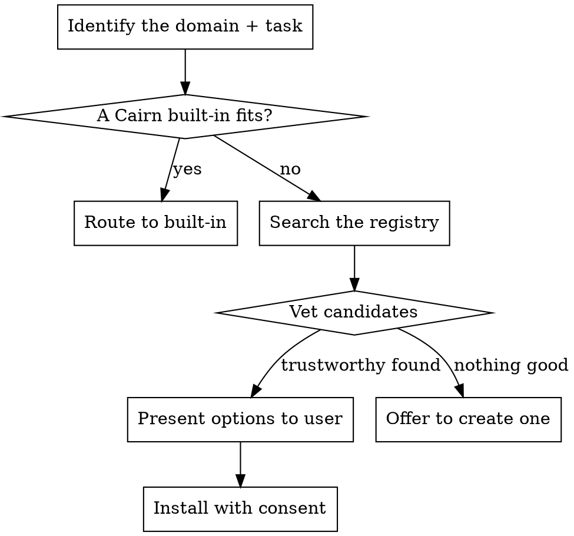

# Cairn — Router

## Overview

Cairn is an open-ended pack: it ships a strong core (brainstorm, resume, tdd, frontend, backend) and **reaches for more when a task needs it**. This skill is the dispatcher. It routes to a Cairn skill when one fits, and otherwise discovers and installs a skill from the ecosystem so you don't have to improvise a capability you could simply *acquire*.

**Core principle:** Prefer a vetted, installed skill over winging it. If the work is common, someone has packaged the expertise.

## Routing — built-ins first

| The request is about… | Route to |
|---|---|
| Starting a project / a feature's design | `cairn-brainstorm` |
| "What were we doing?" / new session in an existing project | `cairn-resume` |
| Implementing logic / a bugfix | `cairn-tdd` |
| Building UI (web/mobile) | `cairn-frontend` |
| Building a service / API / data layer | `cairn-backend` |
| **A capability none of the above covers** | **Find & install (below)** |

## Find & install a skill

When the task needs domain expertise Cairn doesn't bundle, use the open skills tool.



### 1. Search

```bash
npx skills find "pdf form filling"
```

### 2. Vet before recommending

Do **not** recommend on search rank alone. Prefer:

- **Official sources** (`vercel-labs`, `anthropics`, `microsoft`) over unknown authors.
- **Install count** ≥ ~1K; be cautious below ~100 installs.
- **GitHub stars** (~100+) and a real README.

### 3. Present, then install with consent

Show the user the skill name, source, install count, and what it does. On approval:

```bash
npx skills add <owner/repo@skill> -g -y
```

Then continue the task using the newly available skill.

### 4. If nothing good exists

Offer to scaffold a new one:

```bash
npx skills init
```

…and consider authoring it the Cairn way (a focused SKILL.md with a flowchart, concrete commands, and a red-flags table).

## Housekeeping

```bash
npx skills list      # what's installed (alias: ls)
npx skills update    # update installed skills to latest
```

## Red Flags

| Thought | Reality |
|---|---|
| "I'll improvise this capability." | If a vetted skill exists, install it. Don't reinvent expertise. |
| "Top search result, ship it." | Vet source, installs, stars first. |
| "Install silently." | Get consent. Show what and why. |
| "No skill exists, so I'm stuck." | Create one (`npx skills init`) — and graph the decision. |
