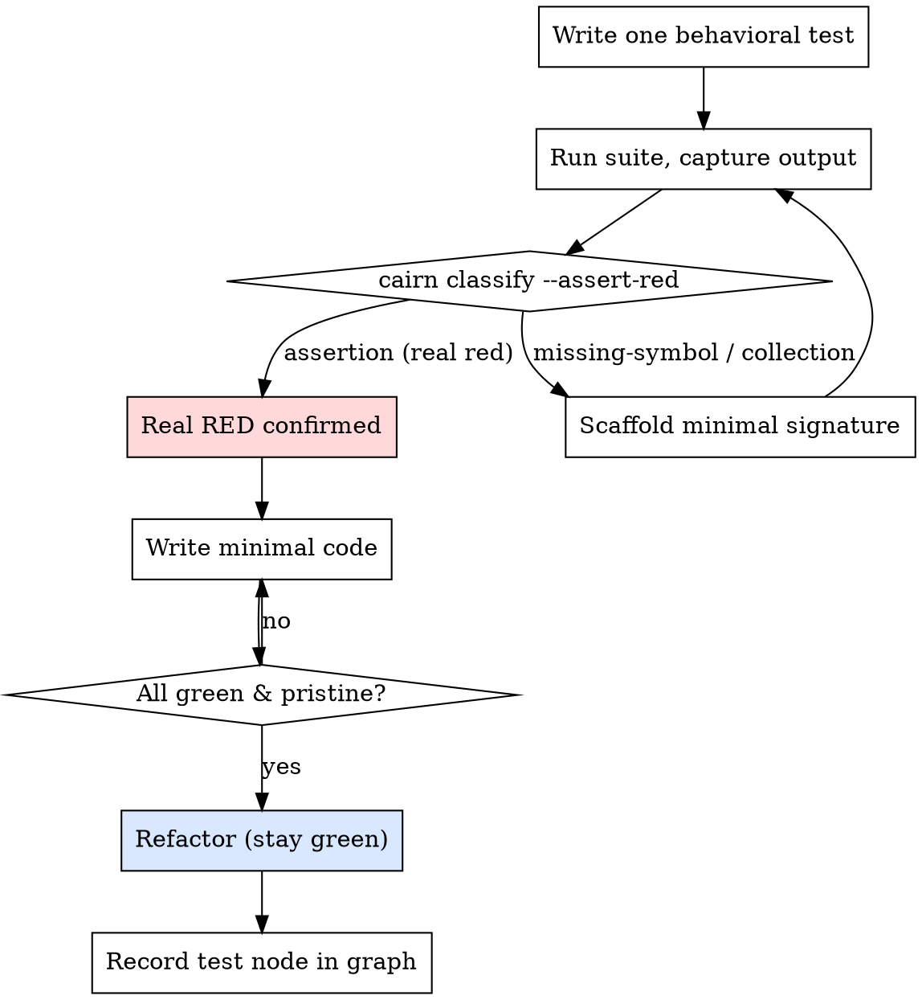

# Cairn — Guaranteed TDD

## Overview

Ordinary "TDD" fails in a specific, common way: the agent writes a test that calls a function that doesn't exist, runs it, sees *some* red, and declares victory — then writes the implementation. But that red was a **missing-symbol error**, not a behavioral failure. The test never actually exercised any logic. Worse, the agent often writes the function and the test together, so at execution time you get *"function not found"* and zero evidence the logic was ever tested.

Cairn fixes this with four guarantees, and a tool that enforces the most important one.

## The Four Guarantees

- **G1 — Red for the right reason.** The first failing run must fail on a real **assertion** (the behavior is wrong), not on a missing symbol, missing module, or syntax error. A missing-symbol "red" is not a red — it's a test that isn't testing anything yet.
- **G2 — Proof of execution.** The test must import and *call* the unit under test from its real module path. If the symbol doesn't exist yet, scaffold the **minimal signature** first (so it's reachable and returns the wrong answer), then assert.
- **G3 — Watched transitions.** You must *run* the suite and observe red→green with your own eyes (captured output), never assume it.
- **G4 — No orphan code.** Every production symbol is reachable from a test. If it isn't tested, it doesn't ship.

## The Iron Law

```
NO PRODUCTION LOGIC WITHOUT A TEST THAT FIRST FAILED ON AN ASSERTION
```

Wrote the implementation before the assertion-level red? Delete it. Start from the test.

## The Loop



## Step 1 — Write ONE behavioral test

One behavior, a clear name, real inputs and outputs. Import the unit from the module path it will actually live at.

```ts
import { retryOperation } from '../src/retry.js'; // does not exist yet — that's expected

test('retries a failing operation until it succeeds', async () => {
  let attempts = 0;
  const op = async () => { attempts += 1; if (attempts < 3) throw new Error('flaky'); return 'ok'; };
  const result = await retryOperation(op, { times: 3 });
  expect(result).toBe('ok');
  expect(attempts).toBe(3);
});
```

## Step 2 — Run it and CLASSIFY the failure (G1, tool-enforced)

Run the suite, capture the output, and pipe it through the classifier:

```bash
npm test 2>&1 | cairn classify --assert-red
```

- **`missing-symbol`** (`retryOperation is not a function`, `Cannot find module`, `NameError`, …) → exit code `2`. **This is NOT a real red.** Go to Step 2a.
- **`collection`** (SyntaxError / failed to collect) → fix the test file itself.
- **`assertion`** (`expected … to be …`) → exit code `0`. **Real red confirmed.** Go to Step 3.

### Step 2a — Scaffold the minimal signature (G2)

Create just enough for the symbol to be reachable and return the *wrong* answer:

```ts
// src/retry.ts
export async function retryOperation<T>(_op: () => Promise<T>, _opts: { times: number }): Promise<T> {
  throw new Error('not implemented'); // reachable, but wrong — now the test can assert
}
```

Re-run Step 2. The failure should now classify as `assertion`. *Only an assertion-level red lets you proceed.*

## Step 3 — Write the minimal code (GREEN)

Just enough to pass the test. No extra options, no speculative features.

```ts
export async function retryOperation<T>(op: () => Promise<T>, opts: { times: number }): Promise<T> {
  let last: unknown;
  for (let i = 0; i < opts.times; i += 1) {
    try { return await op(); } catch (e) { last = e; }
  }
  throw last;
}
```

## Step 4 — Run and WATCH it pass (G3)

```bash
npm test 2>&1 | cairn classify
```

Confirm `kind: "pass"`, every other test still green, and output is **pristine** (no warnings, no stray logs). If it still fails, fix the *code*, never the test.

## Step 5 — Refactor, then record (G4)

Clean up while staying green. Then record the proof in the project graph so it survives the session:

```bash
cairn graph apply ops.json   # a test node + a `tests` edge to the component/requirement
```

```json
{
  "nodes": [{ "ref": "t", "type": "test", "title": "retryOperation retries until success", "status": "done" }],
  "edges": [{ "type": "tests", "from": "t", "to": "component--retry" }]
}
```

## Red Flags

| Thought | Reality |
|---|---|
| "It went red, good enough." | Classify it. A missing-symbol red is not a red. |
| "I'll write the function and the test together." | That's how you get 'function not found' with no proof of testing. Test first, scaffold signature, then assert. |
| "I watched it fail in my head." | G3 means *run it and read the output*. |
| "I'll add options I might need." | YAGNI. Minimal code to pass the current test. |
| "This helper doesn't need a test." | G4: untested logic doesn't ship. |

## When NOT to use (ask the human)

Throwaway spikes, generated code, pure config. Everything else: test first.
